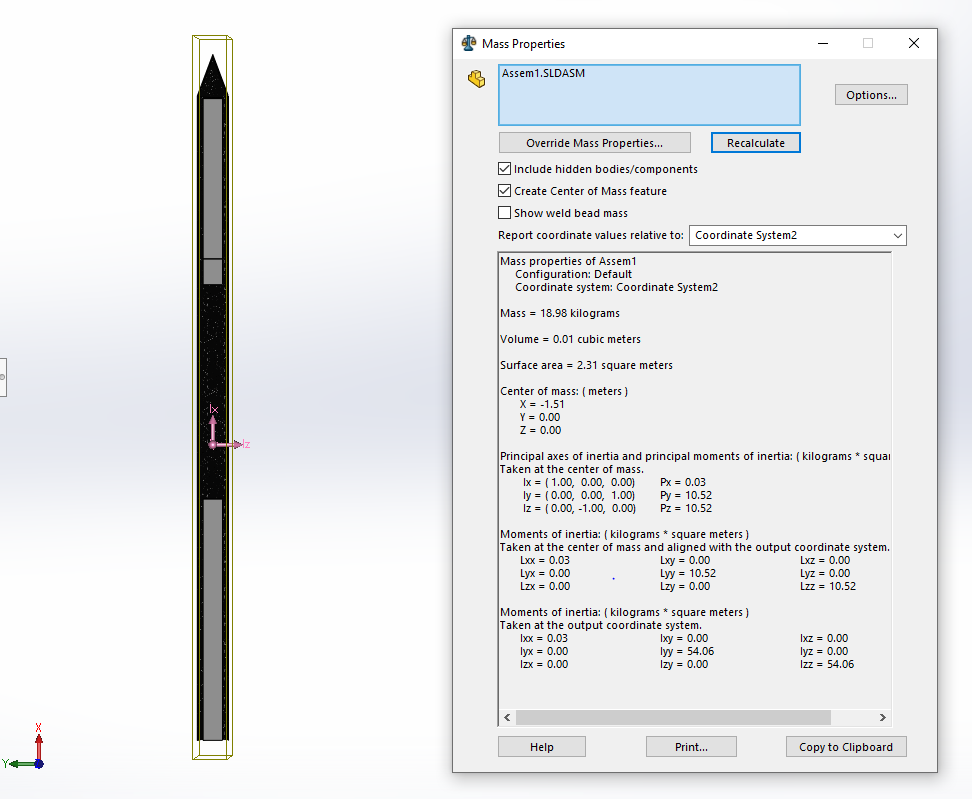
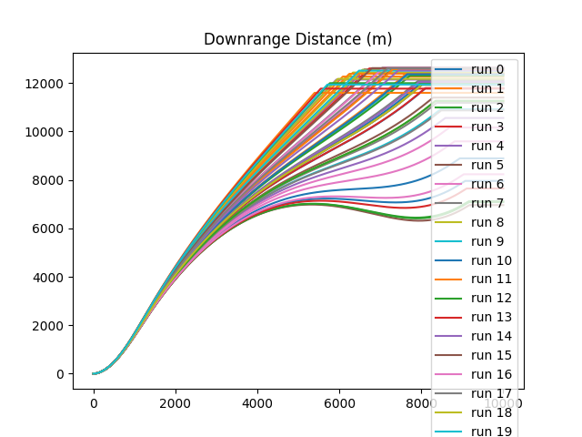
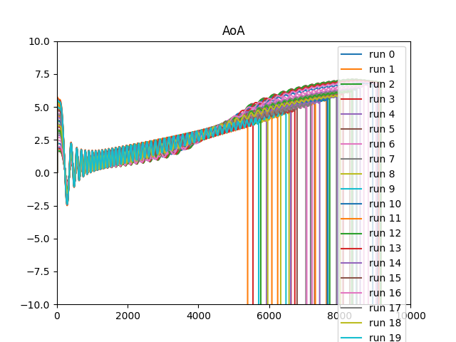
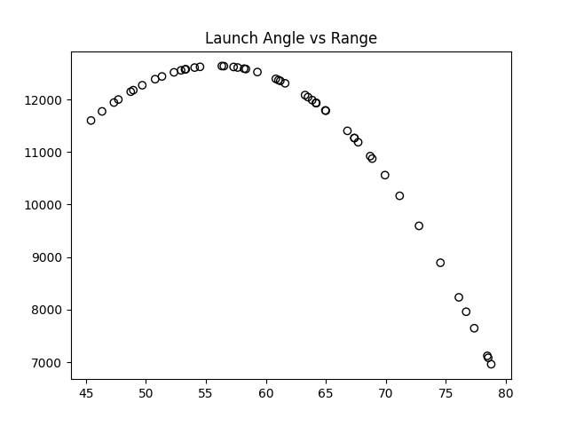
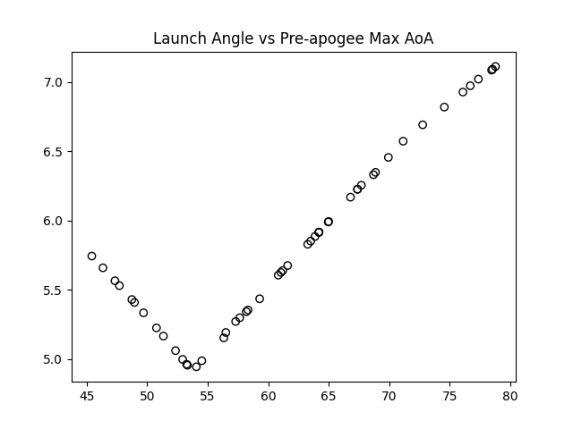
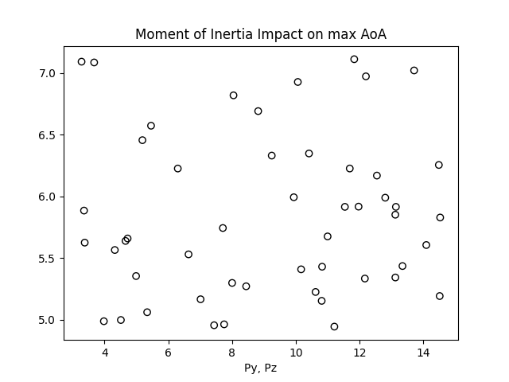

# Missile Sim

# Notes
### Motor:

- mass: 7.008kg
- length: 936mm -> 0.936m
- diameter: 75mm -> 0.075m ------ this drives missile diameter

### Warhead:

- assumed RDX explosive
- mass 5kg
- density: 1.82g/cm3
- calced volume if using motor diameter: 2747 cm3 --> 0.002747 m^3
- calced length if using motor diameter: h=V/pi*r^2 -> h=0.002747/(pi*(0.075/2)^2) -> 0.6218m

### Body

- assume a 4mm thin walled carbon tube
- 1.5578m <- warhead + motor length
- +100mm and +250g if we add electronics (assume 4 inches of length occupied)
- diameter: 0.075m
- overall length: 1.6578m
- mass: 12.0081.1 +0.250kg = 13.450kg

### Complete Missile:
Modeled a 4mm carbon airframe around the rocket (motor, electronics, warhead). Adjusted length and weight distrubution to find a good Moment of Inertia

- Final Mass: 18.98kg
- Principal moments of inertia at center of mass (SW coordinate system is rotated differently than body frame. origin at missile base)
  - 0.01, 2.39, 2.39 Px, Py, Pz

Aero and Mass Properties

- using aero coefficients and math from example given.
- Mass properties are coming from the solidworks assembly.

